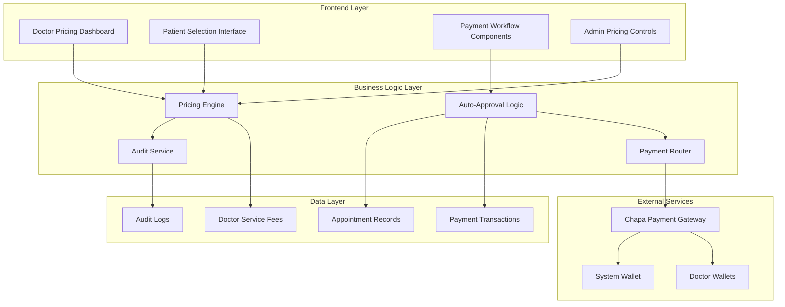
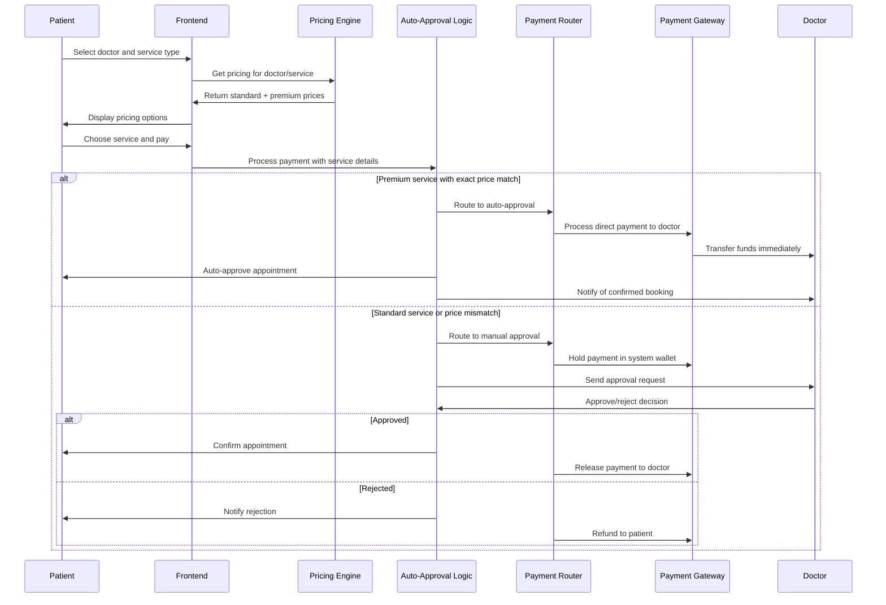

# Enhanced Two-Tier Pricing System Design

## Overview

The Enhanced Two-Tier Pricing System transforms the Elite Tena platform into a sophisticated healthcare marketplace that serves Ethiopia's diverse economic landscape. The system implements intelligent auto-approval logic based on exact price matching, creating separate workflows for affordable standard care (400 ETB fixed) and premium specialist services (2,000-20,000 ETB doctor-set pricing).

The design emphasizes transparency, efficiency, and market-driven pricing while maintaining healthcare accessibility. The auto-approval mechanism eliminates payment disputes for premium services, while manual approval for standard services ensures appropriate care management.

## Architecture

### System Components



### Service Interaction Flow



## Components and Interfaces

### 1. Pricing Engine

**Purpose**: Manages all pricing logic, validation, and retrieval for both tiers.

**Key Methods**:
```typescript
interface PricingEngine {
  getDoctorPricing(doctorId: string): Promise<DoctorPricingInfo>
  setDoctorPremiumPricing(doctorId: string, pricing: PremiumPricing): Promise<void>
  validatePricingRange(serviceType: ServiceType, amount: number): boolean
  getMarketRates(specialty: string): Promise<MarketRateInfo>
  updateStandardRate(newRate: number): Promise<void>
}

interface DoctorPricingInfo {
  doctorId: string
  standardRate: number // Always 400 ETB
  premiumRates: {
    video_call?: number
    chat?: number
  }
  lastUpdated: Date
  isActive: boolean
}
```

### 2. Auto-Approval Logic Engine

**Purpose**: Implements intelligent approval decisions based on service type and payment matching.

**Key Methods**:
```typescript
interface AutoApprovalEngine {
  processBookingRequest(request: BookingRequest): Promise<ApprovalDecision>
  validateExactPriceMatch(doctorId: string, serviceType: ServiceType, paidAmount: number): Promise<boolean>
  determineApprovalPath(request: BookingRequest): ApprovalPath
  executeAutoApproval(appointmentId: string): Promise<void>
  routeForManualApproval(appointmentId: string): Promise<void>
}

type ApprovalPath = 'auto_approve' | 'manual_review' | 'reject_invalid'

interface ApprovalDecision {
  path: ApprovalPath
  reason: string
  requiresPaymentHold: boolean
  estimatedApprovalTime?: string
}
```

### 3. Payment Router

**Purpose**: Directs payments to appropriate destinations based on service tier and approval status.

**Key Methods**:
```typescript
interface PaymentRouter {
  routePayment(payment: PaymentRequest, destination: PaymentDestination): Promise<PaymentResult>
  holdPaymentInSystem(paymentId: string): Promise<void>
  releaseHeldPayment(paymentId: string, doctorId: string): Promise<void>
  processRefund(paymentId: string, reason: string): Promise<void>
  getPaymentStatus(paymentId: string): Promise<PaymentStatus>
}

type PaymentDestination = 'doctor_wallet' | 'system_wallet' | 'hold_pending'

interface PaymentResult {
  success: boolean
  transactionId: string
  destination: PaymentDestination
  processingTime: number
  fees?: number
}
```

### 4. Audit Service

**Purpose**: Comprehensive logging and monitoring of all pricing and payment activities.

**Key Methods**:
```typescript
interface AuditService {
  logPricingChange(change: PricingChangeEvent): Promise<void>
  logPaymentTransaction(transaction: PaymentTransaction): Promise<void>
  logApprovalDecision(decision: ApprovalDecisionEvent): Promise<void>
  generateAuditReport(criteria: AuditCriteria): Promise<AuditReport>
  detectSuspiciousActivity(doctorId: string): Promise<SuspiciousActivityReport>
}
```

## Data Models

### Doctor Service Fees
```sql
CREATE TABLE doctor_service_fees (
    id UUID PRIMARY KEY DEFAULT gen_random_uuid(),
    doctor_id VARCHAR NOT NULL,
    service_type VARCHAR NOT NULL CHECK (service_type IN ('in_person', 'video_call', 'chat')),
    fee_amount DECIMAL(10,2) NOT NULL,
    fee_set_by VARCHAR NOT NULL CHECK (fee_set_by IN ('admin', 'doctor')),
    is_auto_approve BOOLEAN DEFAULT false,
    is_active BOOLEAN DEFAULT true,
    created_at TIMESTAMP DEFAULT CURRENT_TIMESTAMP,
    updated_at TIMESTAMP DEFAULT CURRENT_TIMESTAMP,
    
    UNIQUE(doctor_id, service_type),
    CONSTRAINT valid_premium_range CHECK (
        (service_type = 'in_person' AND fee_amount = 400.00) OR
        (service_type IN ('video_call', 'chat') AND fee_amount BETWEEN 2000.00 AND 20000.00)
    )
);
```

### Enhanced Payment Transactions
```sql
CREATE TABLE enhanced_payment_transactions (
    id UUID PRIMARY KEY DEFAULT gen_random_uuid(),
    appointment_id UUID NOT NULL,
    patient_id VARCHAR NOT NULL,
    doctor_id VARCHAR NOT NULL,
    service_type VARCHAR NOT NULL,
    amount DECIMAL(10,2) NOT NULL,
    expected_amount DECIMAL(10,2) NOT NULL,
    is_exact_match BOOLEAN NOT NULL,
    payment_destination VARCHAR NOT NULL CHECK (payment_destination IN ('doctor_wallet', 'system_wallet')),
    approval_method VARCHAR NOT NULL CHECK (approval_method IN ('auto_approved', 'manual_approved', 'rejected')),
    transaction_status VARCHAR NOT NULL DEFAULT 'pending',
    chapa_transaction_id VARCHAR,
    doctor_wallet_address VARCHAR,
    processing_fees DECIMAL(10,2) DEFAULT 0,
    refund_amount DECIMAL(10,2),
    refund_reason TEXT,
    created_at TIMESTAMP DEFAULT CURRENT_TIMESTAMP,
    completed_at TIMESTAMP,
    
    FOREIGN KEY (appointment_id) REFERENCES appointments(id)
);
```

### Pricing Audit Log
```sql
CREATE TABLE pricing_audit_log (
    id UUID PRIMARY KEY DEFAULT gen_random_uuid(),
    doctor_id VARCHAR NOT NULL,
    service_type VARCHAR NOT NULL,
    action_type VARCHAR NOT NULL CHECK (action_type IN ('create', 'update', 'delete', 'suspend')),
    old_amount DECIMAL(10,2),
    new_amount DECIMAL(10,2),
    changed_by VARCHAR NOT NULL,
    change_reason TEXT,
    is_admin_override BOOLEAN DEFAULT false,
    created_at TIMESTAMP DEFAULT CURRENT_TIMESTAMP
);
```

### Market Rate Analytics
```sql
CREATE TABLE market_rate_analytics (
    id UUID PRIMARY KEY DEFAULT gen_random_uuid(),
    specialty VARCHAR NOT NULL,
    service_type VARCHAR NOT NULL,
    avg_rate DECIMAL(10,2) NOT NULL,
    min_rate DECIMAL(10,2) NOT NULL,
    max_rate DECIMAL(10,2) NOT NULL,
    doctor_count INTEGER NOT NULL,
    calculation_date DATE NOT NULL,
    
    UNIQUE(specialty, service_type, calculation_date)
);
```

## Error Handling

### Payment Processing Errors
- **Invalid Amount**: Clear messaging about expected vs. paid amount
- **Payment Gateway Failures**: Automatic retry with exponential backoff
- **Wallet Transfer Failures**: Hold payment and retry, notify doctor of delays
- **Insufficient Funds**: Immediate notification with alternative payment options

### Pricing Validation Errors
- **Out of Range**: Enforce 2,000-20,000 ETB limits with helpful guidance
- **Duplicate Service Types**: Prevent multiple active rates for same service
- **Unauthorized Changes**: Audit log all attempts and block invalid modifications

### Auto-Approval Logic Errors
- **Price Mismatch**: Route to manual approval with clear explanation
- **Service Unavailable**: Check doctor availability before processing
- **System Overload**: Graceful degradation to manual approval mode

## Testing Strategy

### Unit Testing
- Pricing validation logic with edge cases (1,999 ETB, 20,001 ETB)
- Auto-approval decision matrix for all service type combinations
- Payment routing logic for different approval paths
- Audit logging completeness and accuracy

### Property-Based Testing
Property-based tests will verify universal behaviors across all valid inputs using fast-check library with minimum 100 iterations per test.

## Correctness Properties

*A property is a characteristic or behavior that should hold true across all valid executions of a system-essentially, a formal statement about what the system should do. Properties serve as the bridge between human-readable specifications and machine-verifiable correctness guarantees.*

### Property Reflection

After analyzing all acceptance criteria, several properties can be consolidated to eliminate redundancy:

- Properties 1.2 and 10.1 both test price range validation - combined into Property 1
- Properties 6.1 and 7.1 both test premium payment routing - combined into Property 2  
- Properties 3.1, 3.2, and 3.4 all test auto-approval workflow - combined into Property 3
- Properties 8.2, 8.3, and 8.4 all test refund processing - combined into Property 4
- Properties 9.1, 9.2, and 9.3 all test audit logging - combined into Property 5

### Core Correctness Properties

**Property 1: Premium pricing validation**
*For any* doctor and premium service type (video_call or chat), when setting a price, the system should accept amounts between 2,000 and 20,000 ETB inclusive, and reject all other amounts
**Validates: Requirements 1.2, 10.1**

**Property 2: Premium payment routing**
*For any* auto-approved premium appointment, the payment should be transferred directly to the doctor's designated wallet within 5 minutes of approval
**Validates: Requirements 6.1, 7.1**

**Property 3: Auto-approval logic**
*For any* premium service booking where the patient pays exactly the doctor's set price, the system should automatically approve the appointment, confirm it immediately, and notify both parties
**Validates: Requirements 3.1, 3.2, 3.4**

**Property 4: Manual approval for standard services**
*For any* standard in-person consultation booking, regardless of payment amount, the system should route the appointment for manual doctor approval
**Validates: Requirements 4.1**

**Property 5: Payment holding for standard services**
*For any* standard service payment, the system should hold the funds in the system wallet until consultation completion, then transfer to the doctor
**Validates: Requirements 6.2, 5.4, 5.5**

**Property 6: Price mismatch handling**
*For any* premium service booking where the patient payment does not exactly match the doctor's set price, the system should route the appointment for manual approval
**Validates: Requirements 3.3**

**Property 7: Refund processing**
*For any* rejected standard appointment or pre-approval cancellation, the system should process a full refund within 24 hours and notify the patient
**Validates: Requirements 8.2, 8.3, 4.4**

**Property 8: Audit trail completeness**
*For any* pricing change, payment transaction, or auto-approval decision, the system should log all required details including timestamps, user IDs, amounts, and decision criteria
**Validates: Requirements 9.1, 9.2, 9.3**

**Property 9: No-refund policy enforcement**
*For any* auto-approved premium appointment, the system should prevent cancellation and clearly communicate the no-refund policy to patients
**Validates: Requirements 3.5, 8.1**

**Property 10: Market rate display**
*For any* doctor selection view, the system should display both standard (400 ETB) and premium pricing along with market context for the specialty
**Validates: Requirements 2.1, 2.2, 2.5**

### Integration Testing
- End-to-end booking flows for both service tiers
- Payment gateway integration with different approval paths
- Cross-component data consistency during concurrent operations
- Performance testing under high booking volumes

### Security Testing
- Payment routing security and fraud prevention
- Audit log tampering prevention
- Pricing manipulation attempts
- Unauthorized access to pricing controls

The testing strategy ensures the two-tier pricing system maintains integrity, performance, and security while delivering the innovative auto-approval experience that differentiates the platform in the Ethiopian healthcare market.