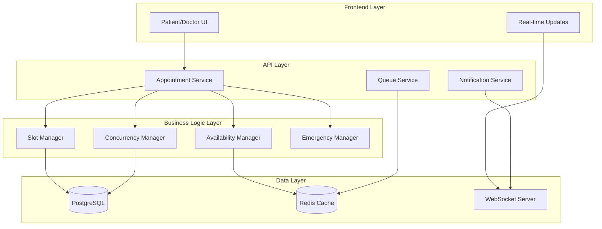

# Smart Appointment Scheduling System - Design Document

## Overview

The Smart Appointment Scheduling System is a comprehensive solution that prevents appointment conflicts, manages dynamic doctor availability, and handles real-time schedule changes. The system is built around atomic time slot management, concurrent booking prevention, and intelligent queue management to ensure reliable appointment scheduling.

## Architecture

### High-Level Architecture



### Core Components

1. **Slot Manager**: Handles time slot creation, booking, and availability
2. **Concurrency Manager**: Prevents race conditions and double-bookings
3. **Availability Manager**: Manages doctor availability and schedule templates
4. **Emergency Manager**: Handles urgent appointments and slot reallocation
5. **Queue Service**: Manages patient queues and wait times
6. **Notification Service**: Sends real-time updates to users

## Components and Interfaces

### 1. Time Slot Management

**TimeSlot Entity:**
```typescript
interface TimeSlot {
  id: string;
  doctorId: string;
  startTime: DateTime;
  endTime: DateTime;
  status: 'available' | 'booked' | 'blocked' | 'emergency_reserved';
  appointmentId?: string;
  bufferTime: number; // minutes
  slotType: 'regular' | 'emergency';
}
```

**SlotManager Interface:**
```typescript
interface SlotManager {
  createSlots(doctorId: string, schedule: Schedule): Promise<TimeSlot[]>;
  bookSlot(slotId: string, appointmentData: AppointmentData): Promise<BookingResult>;
  releaseSlot(slotId: string): Promise<void>;
  blockSlots(doctorId: string, startTime: DateTime, endTime: DateTime): Promise<void>;
  getAvailableSlots(doctorId: string, date: Date): Promise<TimeSlot[]>;
}
```

### 2. Concurrency Control

**ConcurrencyManager Interface:**
```typescript
interface ConcurrencyManager {
  acquireSlotLock(slotId: string): Promise<Lock>;
  releaseLock(lock: Lock): Promise<void>;
  executeAtomicBooking(operation: BookingOperation): Promise<BookingResult>;
  handleConcurrentBookings(requests: BookingRequest[]): Promise<BookingResult[]>;
}
```

### 3. Doctor Availability

**DoctorAvailability Entity:**
```typescript
interface DoctorAvailability {
  id: string;
  doctorId: string;
  date: Date;
  timeSlots: AvailabilitySlot[];
  isAvailable: boolean;
  emergencySlotPercentage: number;
  bufferTime: number;
  maxDailyAppointments: number;
}

interface AvailabilitySlot {
  startTime: string; // HH:mm format
  endTime: string;
  slotType: 'available' | 'break' | 'lunch' | 'unavailable';
}
```

### 4. Queue Management

**PatientQueue Entity:**
```typescript
interface PatientQueue {
  id: string;
  doctorId: string;
  date: Date;
  patients: QueueEntry[];
  currentPosition: number;
}

interface QueueEntry {
  patientId: string;
  appointmentId: string;
  scheduledTime: DateTime;
  estimatedTime: DateTime;
  position: number;
  status: 'waiting' | 'in_progress' | 'completed';
  checkInTime?: DateTime;
}
```

## Data Models

### Enhanced Appointment Model

```sql
CREATE TABLE appointments (
  id UUID PRIMARY KEY,
  patient_wallet_address VARCHAR(42) NOT NULL,
  doctor_wallet_address VARCHAR(42) NOT NULL,
  
  -- Time Management
  scheduled_start_time TIMESTAMP NOT NULL,
  scheduled_end_time TIMESTAMP NOT NULL,
  actual_start_time TIMESTAMP,
  actual_end_time TIMESTAMP,
  estimated_duration INTEGER DEFAULT 30, -- minutes
  buffer_time INTEGER DEFAULT 15, -- minutes
  
  -- Status and Type
  status appointment_status DEFAULT 'scheduled',
  appointment_type VARCHAR(50) DEFAULT 'regular',
  urgency_level urgency_level DEFAULT 'normal',
  
  -- Slot Management
  time_slot_ids UUID[] NOT NULL,
  is_emergency BOOLEAN DEFAULT FALSE,
  requires_rescheduling BOOLEAN DEFAULT FALSE,
  
  -- Queue Management
  queue_position INTEGER,
  estimated_wait_time INTEGER, -- minutes
  check_in_time TIMESTAMP,
  
  -- Metadata
  reason TEXT,
  notes TEXT,
  fee DECIMAL(10,2) DEFAULT 0.00,
  payment_status payment_status DEFAULT 'pending',
  
  created_at TIMESTAMP DEFAULT NOW(),
  updated_at TIMESTAMP DEFAULT NOW()
);

CREATE TYPE appointment_status AS ENUM (
  'scheduled', 'confirmed', 'in_progress', 'completed', 
  'cancelled', 'no_show', 'rescheduled', 'delayed'
);

CREATE TYPE urgency_level AS ENUM ('low', 'normal', 'high', 'emergency');
CREATE TYPE payment_status AS ENUM ('pending', 'paid', 'confirmed', 'refunded');
```

### Time Slots Table

```sql
CREATE TABLE time_slots (
  id UUID PRIMARY KEY,
  doctor_wallet_address VARCHAR(42) NOT NULL,
  
  -- Time Information
  start_time TIMESTAMP NOT NULL,
  end_time TIMESTAMP NOT NULL,
  duration INTEGER NOT NULL, -- minutes
  
  -- Availability
  status slot_status DEFAULT 'available',
  slot_type slot_type DEFAULT 'regular',
  
  -- Relationships
  appointment_id UUID REFERENCES appointments(id),
  availability_template_id UUID,
  
  -- Constraints
  buffer_time INTEGER DEFAULT 15,
  is_bookable BOOLEAN DEFAULT TRUE,
  
  created_at TIMESTAMP DEFAULT NOW(),
  updated_at TIMESTAMP DEFAULT NOW(),
  
  -- Prevent overlapping slots for same doctor
  CONSTRAINT no_overlapping_slots EXCLUDE USING gist (
    doctor_wallet_address WITH =,
    tsrange(start_time, end_time) WITH &&
  ) WHERE (status != 'cancelled')
);

CREATE TYPE slot_status AS ENUM (
  'available', 'booked', 'blocked', 'emergency_reserved', 'cancelled'
);

CREATE TYPE slot_type AS ENUM ('regular', 'emergency', 'buffer');
```

### Doctor Availability Templates

```sql
CREATE TABLE doctor_availability_templates (
  id UUID PRIMARY KEY,
  doctor_wallet_address VARCHAR(42) NOT NULL,
  
  -- Template Information
  name VARCHAR(100) NOT NULL,
  day_of_week INTEGER NOT NULL, -- 0-6 (Sunday-Saturday)
  
  -- Time Slots
  available_slots JSONB NOT NULL, -- Array of {startTime, endTime, type}
  
  -- Configuration
  slot_duration INTEGER DEFAULT 30, -- minutes
  buffer_time INTEGER DEFAULT 15, -- minutes
  emergency_slot_percentage DECIMAL(3,2) DEFAULT 0.20, -- 20%
  max_daily_appointments INTEGER DEFAULT 20,
  
  -- Status
  is_active BOOLEAN DEFAULT TRUE,
  effective_from DATE DEFAULT CURRENT_DATE,
  effective_until DATE,
  
  created_at TIMESTAMP DEFAULT NOW(),
  updated_at TIMESTAMP DEFAULT NOW()
);
```

### Patient Queue Table

```sql
CREATE TABLE patient_queues (
  id UUID PRIMARY KEY,
  doctor_wallet_address VARCHAR(42) NOT NULL,
  queue_date DATE NOT NULL,
  
  -- Queue State
  current_position INTEGER DEFAULT 1,
  total_patients INTEGER DEFAULT 0,
  average_wait_time INTEGER DEFAULT 30, -- minutes
  
  -- Status
  is_active BOOLEAN DEFAULT TRUE,
  last_updated TIMESTAMP DEFAULT NOW(),
  
  UNIQUE(doctor_wallet_address, queue_date)
);

CREATE TABLE queue_entries (
  id UUID PRIMARY KEY,
  queue_id UUID REFERENCES patient_queues(id),
  appointment_id UUID REFERENCES appointments(id),
  
  -- Position Information
  queue_position INTEGER NOT NULL,
  estimated_wait_time INTEGER, -- minutes
  
  -- Timing
  check_in_time TIMESTAMP,
  called_time TIMESTAMP,
  consultation_start_time TIMESTAMP,
  
  -- Status
  status queue_status DEFAULT 'waiting',
  
  created_at TIMESTAMP DEFAULT NOW(),
  updated_at TIMESTAMP DEFAULT NOW()
);

CREATE TYPE queue_status AS ENUM (
  'waiting', 'called', 'in_progress', 'completed', 'no_show'
);
```

## Correctness Properties

*A property is a characteristic or behavior that should hold true across all valid executions of a system-essentially, a formal statement about what the system should do. Properties serve as the bridge between human-readable specifications and machine-verifiable correctness guarantees.*

### Property Reflection

After reviewing all properties identified in the prework, I've identified several areas where properties can be consolidated:

- **Slot booking properties** (1.1, 1.2, 1.3) can be combined into comprehensive booking atomicity
- **Availability management properties** (2.2, 2.3) can be unified into availability state consistency  
- **Notification properties** (4.1, 4.2, 4.5) share similar notification delivery patterns
- **Queue management properties** (7.1, 7.2, 7.5) can be consolidated into queue state consistency
- **Data consistency properties** (8.1, 8.2, 8.4) overlap in ensuring system-wide consistency

### Core Properties

**Property 1: Atomic Slot Booking**
*For any* time slot and booking request, when multiple concurrent booking attempts occur, exactly one booking should succeed and all others should be rejected with the slot marked as unavailable
**Validates: Requirements 1.1, 1.2, 1.3**

**Property 2: Availability State Consistency**
*For any* doctor availability change, all affected time slots should immediately reflect the new availability status and prevent/allow bookings accordingly
**Validates: Requirements 2.2, 2.3**

**Property 3: Schedule Template Application**
*For any* recurring availability pattern, when applied to future dates, all generated time slots should match the template configuration including duration, buffer times, and emergency slot percentages
**Validates: Requirements 2.5, 5.1, 5.2**

**Property 4: Dynamic Duration Management**
*For any* appointment that runs over or under its scheduled time, subsequent time slots should be automatically blocked or released, and affected appointments should have their estimated times recalculated
**Validates: Requirements 3.1, 3.3, 3.4**

**Property 5: Buffer Time Enforcement**
*For any* consecutive appointments, the system should enforce minimum buffer time between them based on appointment type, preventing bookings that violate these constraints
**Validates: Requirements 3.5, 5.3**

**Property 6: Emergency Slot Management**
*For any* emergency appointment request, the system should identify available emergency slots or suggest rescheduling options for non-urgent appointments, while maintaining the configured emergency slot percentage
**Validates: Requirements 6.1, 6.2, 6.4**

**Property 7: Queue Position Consistency**
*For any* patient queue, when appointments are delayed or completed, all queue positions and estimated wait times should be recalculated fairly based on appointment times and current delays
**Validates: Requirements 7.1, 7.2, 7.5**

**Property 8: Notification Delivery Completeness**
*For any* schedule change, delay, or availability update, all affected patients should receive appropriate notifications with accurate information about their appointments
**Validates: Requirements 4.1, 4.2, 4.5**

**Property 9: Appointment Limit Enforcement**
*For any* doctor's daily schedule, when the maximum appointment limit is reached, no additional regular appointments should be bookable while emergency slots remain available
**Validates: Requirements 5.4**

**Property 10: Transaction Atomicity**
*For any* booking operation, the system should either complete all related updates (slot status, appointment creation, queue updates) successfully or roll back all changes completely
**Validates: Requirements 8.1, 8.2, 8.3**

**Property 11: Real-time Synchronization**
*For any* availability or schedule change, all active user sessions should receive updates within a specified time window, ensuring consistent state across all interfaces
**Validates: Requirements 8.4, 8.5**

**Property 12: Alternative Slot Suggestions**
*For any* failed booking attempt due to unavailability, the system should suggest alternative available slots within the same day that meet the appointment requirements
**Validates: Requirements 1.4**

## Error Handling

### Concurrency Conflicts
- **Optimistic Locking**: Use version numbers to detect concurrent modifications
- **Retry Logic**: Implement exponential backoff for failed booking attempts
- **Deadlock Prevention**: Establish consistent lock ordering to prevent deadlocks

### System Failures
- **Transaction Rollback**: Ensure atomic operations with proper rollback mechanisms
- **Circuit Breaker**: Prevent cascade failures in notification and queue services
- **Graceful Degradation**: Maintain core booking functionality even if auxiliary services fail

### Data Consistency
- **Event Sourcing**: Track all appointment state changes for audit and recovery
- **Eventual Consistency**: Handle temporary inconsistencies in distributed components
- **Conflict Resolution**: Define clear rules for resolving scheduling conflicts

## Testing Strategy

### Unit Testing
- Test individual components (SlotManager, ConcurrencyManager, etc.)
- Mock external dependencies (database, notification service)
- Focus on business logic validation and edge cases
- Test error conditions and boundary values

### Property-Based Testing
- Use **fast-check** library for JavaScript/TypeScript property-based testing
- Configure each property-based test to run a minimum of 100 iterations
- Generate random appointment data, time slots, and concurrent scenarios
- Test universal properties that should hold across all inputs

**Property-Based Test Requirements:**
- Each correctness property must be implemented by a single property-based test
- Each test must be tagged with the format: `**Feature: smart-appointment-scheduling, Property {number}: {property_text}**`
- Tests must validate real functionality without mocks where possible
- Smart generators should constrain input space to valid appointment scenarios

### Integration Testing
- Test complete booking workflows with real database transactions
- Verify WebSocket real-time updates across multiple client sessions
- Test concurrent booking scenarios with multiple simulated users
- Validate notification delivery and queue management integration

### Load Testing
- Simulate high concurrent booking loads to test system scalability
- Verify database performance under concurrent slot booking scenarios
- Test WebSocket connection limits and real-time update performance
- Validate queue management performance with large numbers of waiting patients